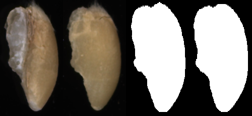

# Overview

This repository contains detailed information for our *ECAI2023* paper entitled **Identifying the Defective: Detecting Damaged Grains for Cereal Appearance Inspection** ([ECAI2023](https://ebooks.iospress.nl/doi/10.3233/FAIA230329): https://ebooks.iospress.nl/doi/10.3233/FAIA230329 , [ArXiv](https://arxiv.org/abs/2311.11901): https://arxiv.org/abs/2311.11901).


## Get Started 

### Environment 

- Python3.8

- Packages  or  `pip install -r requirements.txt`
```
  torch==1.12.1
  torchvision==0.13.1
  numpy==1.22.4
  opencv-python==4.5.1
```


### Datasets

#### OOD-GrainSet

To train on the OOD-GrainSet (see below) and extract it. 

The dataset folders/files follow its original structure.

#### MvTecAD

To train on the MVtec Anomaly Detection dataset [download](https://www.mvtec.com/company/research/datasets/mvtec-ad) the data and extract it. The [Describable Textures dataset](https://www.robots.ox.ac.uk/~vgg/data/dtd/) was used as the anomaly source  image set in most of the experiments in the paper. You can run the **download_dataset.sh** script from the project directory to download the DTD datasets to the **texture** folder in the project directory:

```
./texture/download_dataset.sh
```

The dataset folders/files follow its original structure.

### Run

Please specicy dataset path (line1) and log folder (line10) in `run_*.sh` before running. Edit `run_*.sh` to edit dataset class and dataset path.(such as `run_mvtec.sh,run_wheat_set1.sh`,...)

`run_*.sh` gives the configuration to train models on MVTecAD dataset.

```
bash run_*.sh
```


# Dataset

Our dataset, called **OOD-GrainSet**, involves two types of cereal grains: wheat and maize. 

- For wheat data, we annotated about $180K$ single-kernel images, including $145K$ healthy grains and $5K$ images for each damaged grain category and impurities. 
- For maize data, we annotated about $40K$ single-kernel images, including $33K$ healthy grains and $1K$ images for each damaged grain category and impurities.

## Category Abbreviation

|Species| Category| Abbreviation|
|----|-----|------|
|Wheat, Maize| Healthy grains| HY|
|Wheat, Maize| Sprouted grains| SD|
|Wheat, Maize| Fusarium & Shrivele grains| F&S|
|Wheat, Maize| Broken grains| BN|
|Wheat, Maize| Grains attacked by pests| AP|
|Wheat, Maize| Impurities| IM|
|**Wheat**| Black point grains| BP|
|**Maize**| Heated grains| HD|


## Defective Grain Distributions


|       | HY | SD | FS | BP/HD| MY| BN | AP| IM | Total |
| ----- | ----------- | ------------ | ------------ | ---------------------------- | --------- | ---------- | --------------------- | --------------- | ----- |
| Wheat | 135K        | 5k           | 5k           | 5k                           | 5k        | 5k         | 5k                    | 5k              | 180K  |
| Maize | 33k         | 1k           | 1k           | 1k                           | 1k        | 1k         | 1k                    | 1k              | 40K   |


## Subset Partition

Based on the whole **OOD-GrainSet**, we conduct two data partition schedules in experiments, *i.e.*, 
  - **Set1:** healthy grains vs. damaged grains
  - **Set2:** edible grains vs. inedible grains (*BN, AP, BP and HD are also edible to some extent*)


|       | HY | SD | FS | BP/HD| MY| BN | AP| IM| 
| ----- | ----------- | ------------ | ------------ | -------------------------| --------- | ---------- | --------------------- | --------------- | 
| Set1 (healthy) | $\times$        | $\times$           | $\times$           | $\times$                           | $\times$       | $\times$         | $\times$                    | $\times$             |
| Set2 (edible) | $\checkmark$         | $\times$           | $\times$           | $\checkmark$                           | $\times$       | $\checkmark$         | $\checkmark$                    | $\times$             | 

 


## Access the *OOD-GrainSet*

- Wheat:  
  - Images: [OOD-GrainSet-Wheat (180k, 17.6GB)](https://figshare.com/articles/dataset/OOD-GrainSet_wheat_/23705712)
  - Training/test file index [OOD-GrainSet-Wheat  train/test.txt and category information (5 files, 42MB)](https://figshare.com/articles/dataset/OOD-GrainSet-Wheat_train_test_txt_and_category_information/23717322)
- Maize
  - Images [OOD-GrainSet-Maize (40K, 13.4GB)](https://figshare.com/articles/dataset/OOD-GrainSet-maize/23715714)
  - Training/test file index [OOD-GrainSet-Maize  train/test.txt and category information (5 files, 9MB)](https://figshare.com/articles/dataset/OOD-GrainSet-Maize_train_test_txt_and_category_information/23717385) 


# Data Acquisition


## Example

<!-- 
|       | HY(healthy) | SD(sprouted) | FS(fusarium) | BP (black point)/HD (heated) | MY(moldy) | BN(broken) | AP(attacked by pests) | IM (impurities) |
| ----- | ----------- | ------------ | ------------ | ------------------------- | --------- | ---------- | --------------------- | --------------- | 
| Wheat |          |    |                        |                               |            |             |                        |                  | 
| Maize |          |    |                        |                               |            |             |                        |                  | 
-->


|       | HY | SD | FS | BP/HD| MY| BN | AP| IM |
| ----- | ----------- | ------------ | ------------ | ------------------------- | --------- | ---------- | --------------------- | --------------- |
| Wheat |       |       |         |                    |         |           |                     |        | 
| Maize |       |       |         |                    |         |           |                     |        | 


## Annotations

**Overview**

- **Raw grain smaples to Image data**
 

- **Sample Collection**
  - Crops are havested and transported into the grain centers
  - Raw grains are sampled to extract laboratory samples
  - Laboratory samples are further pre-processed by using handed tools, such as sieves, fans, tweezers
- **Image Acquisition**
  - Grain kernels are fed into our device
  - Our framework can produce a number of single-kernel images
- **Image Annotation** 


 

  - we have engaged a team of six experienced annotators: 
    - 1) four senior inspectors with 5-10 years of inspection experience and currently working in authoritative quality inspection centers; 
    - 2) two experts with over 10 years of experience and holding leadership positions in the quality inspection center, who are also involved in the development of several national standards related to cereal grains.  
- The annotation for each kernel involves multiple steps to ensure consistency and accuracy:
   - 1) if all 4 senior inspectors assign the same label, then the label is confirmed (more than 99.9% of kernels are annotated in this step);
   - 2) in case where 3 of 4 senior inspectors assign the same label, then two experts are consulted to reach a final agreement and confirm the label;
   - 3) the remaining images are discarded.
 -  **To maintain the high quality of our dataset, we exclusively include samples from step1 and step2 samples in our OOD-GrainSet.**


# Citation


If our paper has been of assistance, we would appreciate it if you could consider citing it in your work.

``` bibtex


@incollection{fan2023ai4graininsp,
  title={Identifying the Defective: Detecting Damaged Grains for Cereal Appearance Inspection},
  author={Fan, Lei and Ding, Yiwen and Fan, Dongdong and Wu, Yong and Pagnucco, Maurice and Song, Yang},
  booktitle={ECAI 2023},
  year={2023},
  publisher={IOS Press}
}


@inproceedings{fan2022grainspace,
  title={GrainSpace: A Large-scale Dataset for Fine-grained and Domain-adaptive Recognition of Cereal Grains},
  author={Fan, Lei and Ding, Yiwen and Fan, Dongdong and Di, Donglin and Pagnucco, Maurice and Song, Yang},
  booktitle={Proceedings of the IEEE/CVF Conference on Computer Vision and Pattern Recognition},
  pages={21116--21125},
  year={2022}
}


@article{fan2023annotated,
  title={An annotated grain kernel image database for visual quality inspection},
  author={Fan, Lei and Ding, Yiwen and Fan, Dongdong and Wu, Yong and Chu, Hongxia and Pagnucco, Maurice and Song, Yang},
  journal={Scientific Data},
  volume={10},
  number={1},
  pages={778},
  year={2023},
  publisher={Nature Publishing Group UK London}
}


@article{fan2023av4gainsp,
  title={AV4GAInsp: An Efficient Dual-Camera System for Identifying Defective Kernels of Cereal Grains},
  author={Fan, Lei and Ding, Yiwen and Fan, Dongdong and Wu, Yong and Chu, Hongxia and Pagnucco, Maurice and Song, Yang},
  journal={IEEE Robotics and Automation Letters},
  year={2023},
  publisher={IEEE}
}

```


## Acknowledgement and License

Thanks for [SimpleNet](https://github.com/DonaldRR/SimpleNet).

All code within the repo is under [MIT license](https://mit-license.org/)


